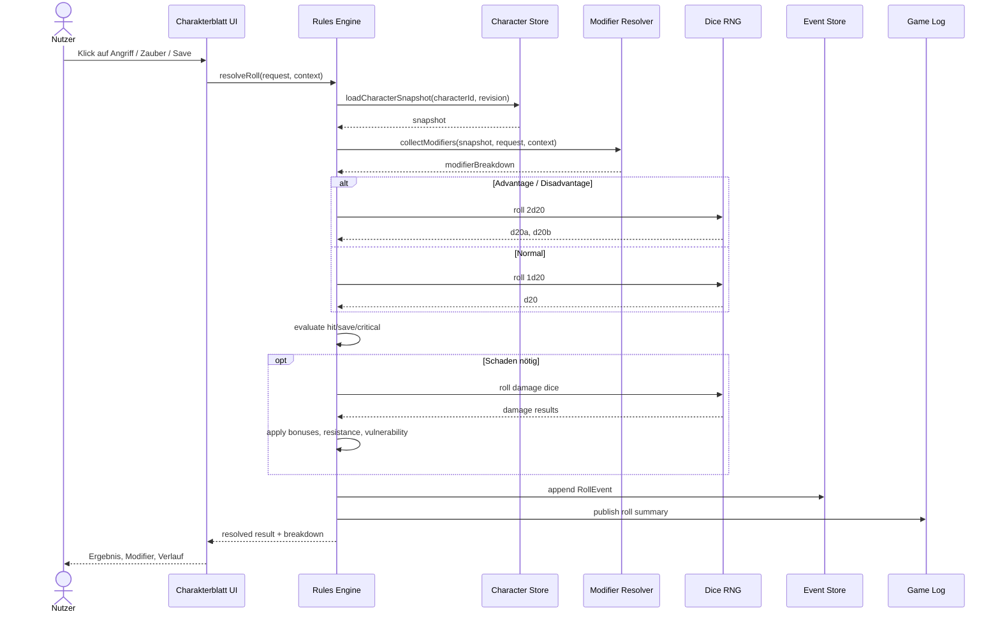

# Dynamisches DnD-Charakterblatt in deutscher Sprache

## Executive Summary

Ein dynamisches Charakterblatt mit echter Parität zu urlD&D Beyondturn18search3 ist kein Formularprojekt, sondern ein regelgetriebenes Produkt mit vier eng gekoppelten Schichten: **Regeldaten**, **Berechnungs-Engine**, **interaktive UI** und **kollaborative Plattformfunktionen**. Die offizielle Plattform deckt heute neben Character Builder und digitalem Charakterblatt auch Quickbuilder, Premades, Digital Dice, Game Log, Character Sheets in Maps, PDF-Export, Kampagnen-/Content-Sharing, Homebrew-Collection, Party Inventory, Compendium/My Library und mobile Offline-Wiedergabe zuletzt geöffneter Sheets ab. Wer echte Parität anstrebt, muss daher dieselbe Breite mitdenken und nicht nur AC/HP/Spells in hübsche Kacheln gießen. citeturn39view0turn31view0turn29view7turn29view9turn37view0turn29view1turn29view2turn29view3turn29view6turn29view0turn32search0turn32search1

Die wichtigste Architekturentscheidung ist: **kanonische Eingaben speichern, abgeleitete Werte berechnen**. Klassenwahl, Feats, ausgerüstete Gegenstände, verbrauchte Slots, Conditions und Notizen werden persistiert; Attack-Boni, Spell Save DC, Skill-Modifikatoren, Traglast, verfügbare vorbereitete Zauber und viele UI-Zusammenfassungen werden aus diesen Daten plus einer versionierten Regelbasis berechnet. Das reduziert Inkonsistenzen, macht Homebrew beherrschbar und ist die einzige saubere Basis für Mehrfachbearbeitung, Audit-Logs und Editionswechsel. Die offiziellen Regeln liefern dafür klare primitive Bausteine: Proficiency Bonus addiert sich auf passende Saves und Attack Rolls, Spell Save DC berechnet sich als 8 + Attributsmodifikator + Proficiency Bonus, Spell Attack Bonus als Attributsmodifikator + Proficiency Bonus, Rituale brauchen 10 Minuten mehr und verbrauchen keinen Slot, und Konzentration endet unter definierten Bedingungen. citeturn10view8turn10view5turn15search8turn15search3turn46view0turn47view0

Für ein deutsches Produkt ist **Lokalisierung von der Regelversion zu entkoppeln**. Offiziell belegt sind derzeit ein **deutsches SRD v5.2.1** und mindestens ein **lokalisiertes Produkt** in deutscher Sprache für Europa; daraus folgt: Deutsch ist realistisch, aber eine vollständig deutsch lokalisierte D&D-Beyond-Gesamterfahrung ist in den hier ausgewerteten offiziellen Quellen nicht vollständig belegt. Das System sollte daher locale-first, aber ruleset-agnostic gebaut werden: `de-DE` als UI-Sprache, dazu getrennte Regelpakete für 2014-, 2024-/5.5e-, Legacy-, Partner- und Homebrew-Inhalte. citeturn28view5turn21search3turn20search0turn38view0

Das beste Liefermodell ist **phasenweise**: erst mechanisch korrekte Kernfläche und Würfel-Engine, dann Spells/Inventar/Rest-Logik, danach Builder/Level-up/Homebrew/Sharing, zuletzt Suche, Offline-Sync-Härtung, Audit und externe Adapter. Direkter automatischer Import aus D&D Beyond sollte **nicht** als sichere Annahme in V1 eingeplant werden; offiziell belegt sind PDF-Export, Kampagnenlinks, Sharing und eingebettete Plattformfunktionen, nicht jedoch eine allgemeine öffentliche Character-Import-API in den hier ausgewerteten offiziellen Quellen. citeturn29view1turn29view2turn36view0turn37view3

## Annahmen und Zielbild

Die größte offene Produktfrage ist die **Edition**. Der Auftrag nennt „DnD“, spezifiziert aber nicht, ob primär 2014-Regeln, 2024-/5.5e-Regeln oder Mischkampagnen gemeint sind. Die offizielle Plattform selbst arbeitet inzwischen mit getrennten Inhaltskategorien für **Core Rules**, **Expanded Rules**, **2014 Core Rules**, **2014 Expanded Rules**, **Legacy/Noncore**, **Partnered Content** und **Homebrew**; außerdem kann die Character-Sheet-Konfiguration diese Quellen granular ein- und ausblenden. Daraus folgt als belastbares Zielbild: **kein monolithisches Regelmodell**, sondern versionierte Regelpakete plus Source-Toggles pro Charakter und optional pro Kampagne. citeturn38view0

Die folgenden Annahmen sollten im Pflichtenheft ausdrücklich als **unspecified** markiert werden, bis Produkt, Legal und Game Design sie festziehen:

| Offener Punkt | Arbeitsannahme | Konsequenz |
|---|---|---|
| Ziel-Edition | **Unspecified**; V1 soll 2014 und 2024 parallel modellieren können | Regel-Engine braucht Rule Packs und Migrationslogik |
| Externe D&D-Beyond-Integration | **Unspecified**; kein direkter API-Import vorausgesetzt | V1 nur manueller Import / PDF / eigenes JSON |
| XP vs. Milestone | **Unspecified**; beides unterstützen | Leveling-UI braucht zwei Modi |
| Encumbrance-Politik | **Unspecified**; kampagnenabhängige Policy | Traglast nur über konfigurierbare Rule Policy |
| Homebrew-Moderation | **Unspecified**; privat + kampagnenintern sicher, öffentlich optional später | separates Publish-/Review-Modul |
| Mobile-Priorität | **Unspecified**; web-first, mobile-echt nutzbar | Responsive-first statt Desktop-Downscale |

Offiziell dokumentiert sind bei der Referenzplattform drei Erzeugungsmodi: **Standard**, **Quickbuilder** und **Premade**. Standard ist schrittweise und optional erklärend; Quickbuilder ist geführt, erzeugt aktuell fertige **Level-1-Charaktere** und soll besonders für Einsteiger schnell sein; Premade erlaubt übernahmefähige vordefinierte Charaktere. Für Parität reicht also kein einziger Builder-Flow. Man braucht mindestens: einen **vollständigen Builder**, einen **geführten Schnellmodus** und einen **Read-only/Claim-Flow** für Templates. citeturn39view0turn43view0turn43view1turn43view3

Die UX-Richtung der Referenzplattform ist inzwischen explizit: einfacher nutzbar, stärker regelkonform, gute Defaults, flexibel anpassbar, auf allen Gerätegrößen brauchbar und mit stärkerem Fokus auf visuelle Auswahl statt Textwänden. Für ein deutsches Produkt heißt das nüchtern übersetzt: **kein PDF-Formular mit React**, sondern ein System, das Regeln und Entscheidungen sichtbar macht, Fehler vorbeugt und deutsche Sprachlängen aushält, ohne sich optisch in Tabellenfriedhöfen zu verheddern. citeturn31view0

## Funktionsinventar und Paritätsmodell

Die offizielle Referenzoberfläche zeigt, dass Parität mehr umfasst als mechanische Regelberechnung. Für die Produktparität sind insbesondere diese Plattformfunktionen offiziell belegt: Builder-Modi, Content-Toggles, PDF-Export, Game Log, Digital Dice mit Advantage/Disadvantage/Critical-Optionen, Kampagnen-Sharing, Homebrew-Collection und -Sharing, Party Inventory, Maps-Einbettung des Charakterblatts, My Library/Compendium und mobile Offline-Wiedergabe des zuletzt online geöffneten Sheets. citeturn39view0turn38view0turn29view1turn29view7turn29view9turn29view2turn29view3turn29view4turn29view6turn37view0turn32search0turn32search1turn29view0

### Offiziell belegte D&D-Beyond-Oberfläche als Paritätsanker

| Produktfläche | Offiziell belegt | Bedeutung für dein Sheet |
|---|---|---|
| Standard Builder | Ja | Voller, granularer Erstellungsfluss |
| Quickbuilder | Ja | geführter Schnellmodus, derzeit Level 1 |
| Premades | Ja | Vorlagen/Claim-Flow |
| Content Categories / Source Toggles | Ja | Rule-Pack-/Source-Gating pro Charakter |
| Digital Dice | Ja | Würfel-UI mit Attack-/Damage-Aktionen |
| Advantage / Disadvantage / Flat Roll | Ja | Kontextmenü pro Wurf |
| Critical Damage Roll | Ja | separater Damage-Modus |
| Game Log | Ja | Roll- und Ergebnis-Historie mit Modifiern |
| Character Sheet in Maps | Ja | embeddable Sheet / Split-View-Fähigkeit |
| Refresh / Sync in Maps | Ja | explizite Re-Sync-Aktion |
| Sichtbarkeit anderer Sheets | Ja | Spieler-Sichtbarkeit pro Sheet steuerbar, DM-Override |
| Campaign Join via Link | Ja | minimaler Kollaborations-Onboarding-Flow |
| Campaign Content Sharing | Ja | gruppenbasierte Content-Entitlements |
| Homebrew Collection | Ja | private/gesammelte Inhalte im Builder/Sheet |
| Private Homebrew Sharing | Ja | kampagneninterne Nutzbarkeit ohne Public Publish |
| Public Homebrew Publishing | Ja | optionaler Publish-Flow |
| Homebrew Classes | Nein, auf D&D Beyond explizit nicht unterstützt | für reine Parität kein Muss in V1 |
| Party Inventory | Ja | geteilte Container / Gruppenschatz |
| Compendium / My Library | Ja | Referenz- und Inhaltsnavigation |
| PDF-Export | Ja | Form-Fillable PDF / Druckausgabe |
| Mobile Offline Cache | Ja | zuletzt geöffnete Daten lokal lesbar |

### Vollständiger Funktionskatalog für das Charakterblatt

Die folgende Matrix ist die eigentliche Produktspezifikation. Wo offizielle Regel- oder Produktdetails in dieser Recherche **nicht** belastbar vorliegen, ist das explizit als **unspecified** markiert, statt so zu tun, als sei alles klar. Grundlage sind die offiziellen D&D- und D&D-Beyond-Regeln/Produktseiten zu Proficiency, Saves, Attack Rolls, Damage, Spellcasting, Rituals, Concentration, Multiclassing, Content-Toggles, Sharing, Homebrew und Export. citeturn10view8turn10view4turn10view5turn9view5turn11view0turn11view1turn46view0turn47view0turn7view4turn38view0turn29view2turn29view3turn29view4turn29view1

| Feature | Pflichtumfang | Engine-/Datenanforderung | Aufwand |
|---|---|---|---|
| Character Creation Wizard | Standard-Flow mit Regeln, Defaults, Fehlervermeidung, Quellenfiltern | Builder State Machine, Rule Pack Resolver, Entitlement-Gating | Hoch |
| Quickbuilder-Äquivalent | geführter Schnellmodus für Einsteiger; V1 idealerweise nur Level 1 | Opinionated presets, minimaler Entscheidungsbaum | Mittel |
| Premade Characters | Vorlagenkatalog + „Charakter übernehmen“ | Template-Instanziierung, Ownership-Rebinding | Mittel |
| Ability Scores | Methodenwahl, Modifikatorberechnung, Quelle jedes Bonus nachvollziehbar | canonical ability scores + modifier pipeline | Mittel |
| Proficiencies | Armor/Weapons/Tools/Languages/Trainings | normalisierte Proficiency-Entitäten, Source Attribution | Mittel |
| Skills | Wert, Proficiency-Status, Source Breakdown, Roll-Aktion | Derived values + condition/exhaustion modifiers | Mittel |
| Saving Throws | Proficiency, Roll-Action, Quelle des DC/Bonus | Derived saves + contextual modifiers | Mittel |
| Attack Rolls | Nahkampf/Fernkampf/Spell Attacks, Kontextmodi | AttackProfile + modifier resolver + roll orchestration | Hoch |
| Damage | Würfel, Modifikatoren, Typen, Resistenz/Vulnerabilität, Crit-Policy | DamageFormula + mitigation pipeline | Hoch |
| Spellcasting | Slots, bekannte/vorbereitete/immer vorbereitete Zauber, Komponenten, Fokus | Spellbook, PreparedState, SlotPools, ClassSpellcasting | Hoch |
| Concentration | Tracker + automatische Prüfungen/Brüche | State machine + event hooks on damage/new effect/incapacitated | Mittel |
| Rituals | Ritual-Tag, +10 Minuten, kein Slotverbrauch | Spell metadata + cast mode policy | Niedrig |
| Multiclassing | Voraussetzungen, getrennte Klassenstände, kombinierte Spell-Slot-Logik | ClassAssignment aggregate + multiclass resolver | Hoch |
| Feats | Auswahl, Voraussetzungen, Source-Gating | Feat grants + prerequisite engine | Mittel |
| Subclasses | Levelgebundene Spezialisierungen, Feature Grants | Class progression + subclass tables | Hoch |
| Equipment | Besitz, Ausrüstung, Attunement/Tags falls Regelpaket es verlangt | Item instances + equip slots | Mittel |
| Inventory | Container, Mengen, Drag-and-Drop, Shared Party Inventory optional | ItemStack + Container graph + ops log | Hoch |
| Encumbrance | Policy-basiert, kampagnenkonfigurierbar | weight/bulk policy plugin; **genaue Formel unspecified** | Mittel |
| Conditions | aktive Conditions mit Regelwirkung | ConditionInstance + derived penalty hooks | Mittel |
| Temporary HP | eigener Pool; **genaue Stapel-/Ersatzlogik hier unspecified** | ResourcePool with replacement policy | Niedrig |
| Inspiration | Token/Flag; Semantik rulesetabhängig | simple binary resource; exact behavior **unspecified** | Niedrig |
| Death Saves | dedizierter Zustand und Tracker; Detailregelung rulesetgesteuert | state machine; detail logic **unspecified in cited excerpt set** | Mittel |
| Rest Mechanics | Short/Long Rest, Ressourcen-Refresh, Hit Dice, Spell Slots | Rest policy engine per class/resource | Hoch |
| XP / Leveling | numerischer XP-Modus + Milestone/Manual Level | progression service + campaign policy | Mittel |
| Homebrew Support | private Sammlung, kampagneninterne Nutzung, optionales Publishing | user content packages + sandbox validation | Hoch |
| Compendium Lookup | freie Regeln, SRD, gekaufte/geteilte Inhalte, Filter/Favoriten | search index + entitlement checks + localization labels | Hoch |
| Import / Export | JSON, PDF, Druckansicht; externer Import adapterbasiert | schema versioning + export renderers | Mittel |
| Permissions / Sharing | Owner, DM, Player, Read/Play/Edit/Share-Sichtbarkeit | role model + campaign membership + field visibility | Hoch |
| Audit / Logs | Roll-History, Änderungsprotokoll, Diff-Ansicht | append-only event store + revision snapshots | Hoch |
| Localization | de-DE UI, getrennte Inhalts-/Regel-Locale, Glossar-Strategie | i18n catalog + localized metadata | Mittel |
| Accessibility | WCAG-2.2-AA-Basis, Tastatur, Screenreader, touch-safe targets | design-system rules + audits | Hoch |

Der mechanische Kern sollte sich an einigen wenigen, aber harten Regelprimitive hängen: Attack Rolls treffen, wenn Wurf ≥ Armor Class; passende Ability Modifiers und Proficiency gelten je nach Attack-/Save-Typ; Weapon Damage verwendet denselben Ability Modifier wie der Angriff; Spell Save DC und Spell Attack Bonus folgen der Standardformel; Resistenz/Vulnerabilität haben eine feste Anwendungsreihenfolge; Rituale und Konzentration haben klar definierte Sonderregeln; Multiclass-Spell-Slots werden über die bekannten Voll-/Halb-/Drittelcaster-Anteile und eine eigene Warlock-Behandlung ermittelt. Genau diese Primitive müssen vollständig erklärbar im UI auftauchen, sonst hast du zwar Rechenlogik, aber keine vertrauenswürdige Oberfläche. citeturn10view4turn10view5turn10view8turn9view5turn11view0turn15search8turn15search3turn46view0turn47view0turn7view4

## UX- und UI-Spezifikation

Die Referenzplattform formuliert ihre Designziele inzwischen bemerkenswert klar: einfacher nutzbar, stärker regelkonform, gute Defaults, flexibel anpassbar, auf allen Gerätegrößen gut bedienbar und mit stärkerem Gewicht auf ikonischer visueller Auswahl statt „Wände aus Text und kleinen Pop-ups“. Genau daraus sollte die deutsche Lösung ihre UI-Prinzipien ableiten. Zusätzlich verlangt WCAG 2.2 einen wahrnehmbaren, bedienbaren, verständlichen und robusten Webauftritt; für Touch-Ziele ist die neue Mindestgröße bzw. Mindestdistanzierung relevant, und bei sprachgemischten Inhalten ist die korrekte Auszeichnung von Sprachwechseln wichtig, damit Screenreader und andere Assistenzsysteme sauber arbeiten. citeturn31view0turn28view1turn28view2turn28view3

### Layout- und Navigationsmodell

Für Desktop ist ein **Drei-Zonen-Layout** am stabilsten:

| Zone | Inhalt | Zweck |
|---|---|---|
| Linke Leiste | Navigation: Übersicht, Kampf, Zauber, Inventar, Features, Notizen, Manage | schneller Moduswechsel |
| Hauptbereich | aktive Karten/Listen/Tabellen des gewählten Bereichs | primäre Interaktion |
| Rechte Kontextspalte | Roll-Log, Tooltip-/Quellendrawer, Modifier-Details, Konfliktbanner | Transparenz statt Magie |

Für Tablet sollte die rechte Kontextspalte als **einblendbarer Drawer** arbeiten. Für Mobile ist ein **Bottom-Navigation-Modell** mit fünf Kernbereichen sinnvoll: `Übersicht`, `Kampf`, `Zauber`, `Inventar`, `Mehr`. Alles andere wird einklappbar. Die Referenzplattform will ausdrücklich auf Phones bis 4K-Monitore gut funktionieren; das ist kein kosmetischer Wunsch, sondern eine Produktanforderung. Zudem ist mobile Offline-Wiedergabe des zuletzt online geöffneten Sheets offiziell belegt, also darf Mobile nicht als zweitklassiger Viewer behandelt werden. citeturn31view0turn29view0turn29view8

### Interaktive Elemente

Die Referenz belegt bereits das Kernmuster für Würfelinteraktionen: primärer Click/Tap auf Attack- oder Damage-Flächen, alternative Modi über Kontextaktion, inklusive Advantage, Disadvantage, Flat Roll und Critical Damage. Diese Logik sollte in einem eigenen universellen `RollButton` münden, nicht pro Sektion neu erfunden werden. citeturn29view7turn29view9

Empfohlene UI-Bausteine:

| Komponente | Verhalten |
|---|---|
| `StatPill` | zeigt Wert, Breakdown, Quelle; Click öffnet Quell-Drawer |
| `RollButton` | primärer Wurf; sekundäre Modi per Kontextmenü bzw. Long-Press |
| `ModifierDrawer` | listet additive und situative Modifikatoren mit Quelle |
| `TooltipCard` | Begriff, Regeltext-Kurzfassung, Quelle, Sprung ins Kompendium |
| `ConditionChip` | aktiv/inaktiv, Regelwirkung im Hover/Drawer |
| `SpellSlotTrack` | klickbare Slots pro Pool und Level |
| `PreparedToggle` | vorbereitet / nicht vorbereitet / immer vorbereitet |
| `InventoryItemRow` | Drag-and-Drop, Containerwechsel, equip/unequip |
| `ConflictBanner` | lokale Änderungen vs. Server-Revision |
| `AuditTimeline` | Änderungen, Rests, Level-up, Roll Events |

### Visuelle Hierarchie

Die obere Zone jedes Sheets sollte permanent fünf bis sieben „lebende“ Werte tragen: **aktuelles HP / max HP**, **temporäre HP**, **AC**, **Initiative**, **Speed**, **aktive Conditions**, **aktiver Concentration-Effekt**. Diese Werte sind während des Spiels häufiger relevant als Biografie, ideale Gesinnung oder Lieblingsinstrument. Das klingt banal, scheitert aber in der Praxis oft daran, dass Designer Listen lieben und Spieltische Tempo brauchen.

Für deutsche Strings gilt: **Abkürzungssystem explizit definieren**. „Bewegung“, „Rettungswurf“, „Fertigkeiten“, „Vorbereitete Zauber“ und zusammengesetzte Item-/Feat-Namen sprengen schnell kleine Chips. Deshalb sollten alle Tokens responsive Slots mit definierter Priorität haben: voller Begriff auf Desktop, standardisierte Kurzform auf Tablet, notfalls Icon + Screenreader-Label auf Mobile. Sprachwechsel in Regelbezeichnungen oder unübersetzten Eigennamen müssen semantisch ausgezeichnet werden; genau dafür ist WCAG 3.1.2 praktisch relevant. citeturn28view3

### Mikrointeraktionen und Accessibility

Mikrointeraktionen sollten nur dort animieren, wo sie Statusänderungen erklären: Slot wird ausgegeben, Condition wird aktiv, Concentration bricht, Sync erfolgreich, Konflikt erkannt. Alles andere ist Zierfisch. Für Accessibility ist **`prefers-reduced-motion`** verpflichtend zu respektieren. Erfolgs- und Fehlerzustände brauchen zusätzlich zu Farbe immer Text/Iconografie. Touch-Ziele für Kernaktionen wie `Rollen`, `Slot ausgeben`, `Condition toggeln`, `Item ausrüsten` sollten mindestens WCAG-2.2-konform dimensioniert oder genügend voneinander distanziert sein. citeturn28view2turn28view1

## Architektur, Datenmodell und Zustandsverwaltung

Die sauberste Architektur ist **Domain-first**:

- **Kanonisch gespeichert** werden nur Entscheidungen und veränderliche Zustände: Klassenstände, Feat-Auswahlen, ausgerüstete Gegenstände, aktuelle HP, aktuelle Temp HP, verbrauchte Slots, aktive Conditions, vorbereitete Zauber, Notizen, Sichtbarkeit und Kampagnenmitgliedschaften.
- **Abgeleitet berechnet** werden alle deterministischen Werte: Skill-Werte, Save-Werte, Attack-Boni, Damage-Breakdowns, Spell Save DC, Spell Attack Bonus, verfügbare Prepared-Slots, Inventory-Summen, Traglast, UI-Badges.
- **Versioniert** werden sowohl der Charakter als auch die zugrunde liegende Regelbasis und die Content-Sources.
- **Event-basiert** wird alles, was später geprüft oder synchronisiert werden muss: Rest, Roll, Slot-Verbrauch, Level-up, Item-Move, Permission-Änderung, Rule-Pack-Migration.

Das ist besonders wichtig, weil die aktuelle Referenzplattform genau die Art von Produkt ist, deren Inhalte und Funktionsoberflächen laufend weiterentwickelt werden: Quickbuilder wird aktiv umgebaut, My Library wurde kürzlich ersetzt, Character Sheets laufen inzwischen auch in Maps, und Content-Toggles unterscheiden mehrere Regelschichten. Ein statisches Datenmodell wird in so einer Welt direkt zu Altlast. citeturn31view0turn32search0turn37view0turn38view0

### Zustandsstrategie und Konfliktauflösung

Nicht jeder Charakterzustand verdient dieselbe Merge-Strategie. Die nüchterne Empfehlung:

| Datentyp | Strategie |
|---|---|
| Scalar user choices | Optimistic UI + Compare-and-Swap auf Revisionsnummer |
| Ressourcen-Zähler | serverautoritatives Delta-Apply mit Rebase |
| Inventar-Operationen | operation-based merge (`move`, `split`, `equip`, `consume`) |
| Notizen / Backstory / Freitext | CRDT / Yjs-artig |
| Roll-Historie / Audit | append-only, nie überschreiben |
| Derived values | nie manuell mergen; immer neu berechnen |

**CRDT überall** klingt modern, ist hier aber falsch. Mechanische Spielzustände brauchen nachvollziehbare Transaktionen, nicht poetische Gleichzeitigkeit. `SpellSlotSpent`, `LongRestApplied` oder `LevelUpCommitted` müssen atomar, auditierbar und regelgültig sein. Dagegen dürfen `character_notes` oder `session_journal` gern kollaborativ und konfliktfrei sein.

### ER-Diagramm

Das folgende Modell ist auf Parität, Kollaboration, Homebrew und Mehr-Editionen ausgelegt. Es leitet sich aus den offiziellen Regelprimitive und den belegten Produktflächen der Referenzplattform ab. citeturn38view0turn39view0turn29view3turn29view4turn29view6turn37view4

```mermaid
erDiagram
  ACCOUNT ||--o{ CHARACTER : owns
  ACCOUNT ||--o{ CAMPAIGN_MEMBERSHIP : has
  CAMPAIGN ||--o{ CAMPAIGN_MEMBERSHIP : includes
  CAMPAIGN ||--o{ CHARACTER : contains
  CAMPAIGN ||--o{ PARTY_CONTAINER : has

  CHARACTER ||--o{ CHARACTER_REVISION : snapshots
  CHARACTER }o--|| RULESET_VERSION : uses
  CHARACTER ||--o{ SOURCE_TOGGLE : filters
  CHARACTER ||--o{ CLASS_ASSIGNMENT : has
  CHARACTER ||--o{ FEAT_SELECTION : has
  CHARACTER ||--o{ ITEM_INSTANCE : owns
  CHARACTER ||--o{ SPELLBOOK_ENTRY : knows
  CHARACTER ||--o{ PREPARED_SPELL : prepares
  CHARACTER ||--o{ RESOURCE_POOL : tracks
  CHARACTER ||--o{ CONDITION_INSTANCE : has
  CHARACTER ||--o{ ATTACK_PROFILE : exposes
  CHARACTER ||--o{ ROLL_EVENT : emits
  CHARACTER ||--o{ AUDIT_EVENT : logs
  CHARACTER ||--o{ SHARE_PERMISSION : grants

  CLASS_ASSIGNMENT }o--|| CLASS_DEFINITION : references
  CLASS_ASSIGNMENT }o--o| SUBCLASS_DEFINITION : specializes
  CLASS_ASSIGNMENT ||--o{ FEATURE_GRANT : grants

  FEAT_SELECTION }o--|| FEAT_DEFINITION : references
  SPELLBOOK_ENTRY }o--|| SPELL_DEFINITION : references
  PREPARED_SPELL }o--|| SPELL_DEFINITION : references
  ATTACK_PROFILE }o--|| ITEM_INSTANCE : derives_from
  ATTACK_PROFILE ||--o{ DAMAGE_COMPONENT : contains

  ITEM_INSTANCE }o--o| ITEM_INSTANCE : contained_in
  PARTY_CONTAINER ||--o{ ITEM_INSTANCE : stores

  RESOURCE_POOL }o--|| RESOURCE_DEFINITION : typed_by
  CONDITION_INSTANCE }o--|| CONDITION_DEFINITION : typed_by

  RULESET_VERSION ||--o{ CLASS_DEFINITION : contains
  RULESET_VERSION ||--o{ SUBCLASS_DEFINITION : contains
  RULESET_VERSION ||--o{ FEAT_DEFINITION : contains
  RULESET_VERSION ||--o{ SPELL_DEFINITION : contains
  RULESET_VERSION ||--o{ ITEM_DEFINITION : contains
  RULESET_VERSION ||--o{ CONDITION_DEFINITION : contains
  RULESET_VERSION ||--o{ RESOURCE_DEFINITION : contains

  HOMEBREW_PACKAGE ||--o{ CLASS_DEFINITION : extends
  HOMEBREW_PACKAGE ||--o{ SUBCLASS_DEFINITION : extends
  HOMEBREW_PACKAGE ||--o{ FEAT_DEFINITION : extends
  HOMEBREW_PACKAGE ||--o{ SPELL_DEFINITION : extends
  HOMEBREW_PACKAGE ||--o{ ITEM_DEFINITION : extends
  HOMEBREW_PACKAGE ||--o{ CONDITION_DEFINITION : extends

  COMPENDIUM_ENTRY }o--|| RULESET_VERSION : from
  COMPENDIUM_ENTRY }o--o| HOMEBREW_PACKAGE : from

  ACCOUNT {
    uuid id
    string display_name
    string locale
  }

  CHARACTER {
    uuid id
    uuid owner_account_id
    uuid campaign_id
    uuid ruleset_version_id
    int current_revision
    string locale
    string visibility_mode
    int current_hp
    int temp_hp
    int xp
    int character_level
  }

  CHARACTER_REVISION {
    uuid id
    uuid character_id
    int revision_no
    string summary
    datetime created_at
  }

  CAMPAIGN {
    uuid id
    string name
    string level_policy
    string content_policy
  }

  CAMPAIGN_MEMBERSHIP {
    uuid id
    uuid account_id
    uuid campaign_id
    string role
  }

  SOURCE_TOGGLE {
    uuid id
    uuid character_id
    string category
    bool enabled
  }

  CLASS_ASSIGNMENT {
    uuid id
    uuid character_id
    uuid class_definition_id
    uuid subclass_definition_id
    int class_level
    bool is_starting_class
  }

  SPELLBOOK_ENTRY {
    uuid id
    uuid character_id
    uuid spell_definition_id
    string acquisition_source
  }

  PREPARED_SPELL {
    uuid id
    uuid character_id
    uuid spell_definition_id
    string prepared_mode
  }

  RESOURCE_POOL {
    uuid id
    uuid character_id
    string code
    int current_value
    int max_value
  }

  CONDITION_INSTANCE {
    uuid id
    uuid character_id
    uuid condition_definition_id
    string source
    datetime expires_at
  }

  ITEM_INSTANCE {
    uuid id
    uuid character_id
    uuid item_definition_id
    uuid container_item_id
    int quantity
    bool equipped
  }

  ATTACK_PROFILE {
    uuid id
    uuid character_id
    uuid item_instance_id
    string attack_type
    string ability_source
  }

  DAMAGE_COMPONENT {
    uuid id
    uuid attack_profile_id
    string damage_type
    string formula
  }

  ROLL_EVENT {
    uuid id
    uuid character_id
    string roll_kind
    string payload_json
    datetime created_at
  }

  AUDIT_EVENT {
    uuid id
    uuid character_id
    string event_type
    string diff_json
    datetime created_at
  }

  SHARE_PERMISSION {
    uuid id
    uuid character_id
    uuid grantee_account_id
    string permission
  }
```



## Regel-Engine

### Würfel-Engine

Die Würfel-Engine muss drei Dinge gleichzeitig leisten: **regelrichtig rechnen**, **ihre eigenen Entscheidungen erklären** und **im Kollaborationskontext publizieren**. Die offiziellen Regeln liefern dazu den harten Kern: Attack Rolls treffen bei `>= AC`; passende Ability Modifiers gelten je nach Angriffsart; Proficiency kommt bei passenden Angriffen und Saves dazu; Weapon Damage nutzt denselben Ability Modifier wie der Angriff; Spell Save DC und Spell Attack Bonus folgen festen Formeln; Resistenz und Vulnerabilität haben feste Reihenfolge; Konzentration beeinflusst Cast-Flows; Digital Dice/Gamelog zeigen, dass Würfe, Modifikatoren und Ergebnis publizierbar sind. citeturn10view4turn10view5turn10view8turn9view5turn11view0turn15search8turn15search3turn29view7turn29view9

Empfohlene Engine-Regeln:

| Thema | Empfehlung |
|---|---|
| RNG | serverseitig oder deterministisch signiert; Client nur Preview |
| Roll Modes | normal, advantage, disadvantage, flat |
| Conditional Modifiers | Kontextregeln als explizite Resolver-Kette |
| Criticals | `critical_policy` aus Rule Pack, nicht hartcodiert |
| Damage Types | jede Komponente typisiert |
| Mitigation | Bonus/Penalty/Multiplier → Resistance → Vulnerability |
| Result Transparency | Breakdown immer speicher- und einblendbar |
| Roll History | append-only `RollEvent` |
| Replayability | Roll payload speichert Input, Context Snapshot, Output |

#### Beispielalgorithmus zur Wurfauflösung

```text
function resolveRoll(request, characterSnapshot, encounterContext, rulePack):
    derived = deriveCharacter(characterSnapshot, rulePack, encounterContext)

    modifiers = collectModifiers(
        request.kind,
        characterSnapshot,
        derived,
        encounterContext,
        rulePack
    )

    rollMode = collapseAdvantageState(
        baseMode = request.rollMode,
        grantedAdvantage = modifiers.advantageCount > 0,
        grantedDisadvantage = modifiers.disadvantageCount > 0
    )

    d20Result =
        if rollMode == ADVANTAGE:
            max(rollD20(), rollD20())
        else if rollMode == DISADVANTAGE:
            min(rollD20(), rollD20())
        else:
            rollD20()

    if request.kind == "ATTACK":
        attackTotal = d20Result + modifiers.attackBonus
        hit = attackTotal >= request.targetAC
        critical = isCriticalHit(d20Result, modifiers.criticalThreshold, rulePack)

        damageBreakdown = []
        if hit:
            for component in request.damageFormula.components:
                rolled = roll(component.dice, criticalPolicy = rulePack.criticalPolicy if critical else NONE)
                subtotal = rolled + component.staticBonus + modifiers.damageBonusFor(component)
                damageBreakdown.append(applyDamageMitigation(
                    subtotal,
                    component.damageType,
                    request.targetDefenses,
                    rulePack
                ))

        result = {
            "kind": "ATTACK",
            "rollMode": rollMode,
            "d20": d20Result,
            "attackTotal": attackTotal,
            "hit": hit,
            "critical": critical,
            "damage": damageBreakdown,
            "modifierBreakdown": modifiers.explain()
        }

    else if request.kind == "SAVE_DC":
        result = {
            "kind": "SAVE_DC",
            "dc": 8 + modifiers.spellcastingAbilityMod + modifiers.proficiencyBonus,
            "modifierBreakdown": modifiers.explain()
        }

    persistRollEvent(result, characterSnapshot.id, encounterContext.campaignId)
    return result
```

#### Sequenzdiagramm zur Wurfauflösung



### Zaubersystem

Das Zaubersystem ist fast immer der Bereich, in dem halbgare Charakterblätter implodieren. Offiziell belegt sind die relevanten Bausteine: vorbereitete Zauber je Klasse mit unterschiedlichen Änderungszeitpunkten, immer vorbereitete Zauber, Slot-Verbrauch und Slot-Restoration nach Long Rest, Ritual-Casting ohne Slot aber mit +10 Minuten, Components `V/S/M`, Materialkosten-/Focus-Substitution, Concentration-Regeln und die Standardformeln für Spell Save DC und Spell Attack Bonus. Für Wizard ist sogar explizit belegt, dass Ritualzauber aus dem Spellbook ritualisiert werden können, ohne vorbereitet zu sein. citeturn46view0turn13view7turn14view0turn14view1turn14view2turn14view3turn13view8turn15search3turn47view0

Empfohlene Spell-UI:

| Bereich | Muss können |
|---|---|
| Spellbook | suchen, filtern, sortieren nach Klasse, Level, Tag, Ritual, Concentration, Components |
| Prepared vs Known | Status klar sichtbar; „immer vorbereitet“ gesondert markieren |
| Cast Panel | Slot-Level wählen, Ritual-Cast wählen, Component-Hinweise, Concentration-Hinweis |
| Slot Tracker | getrennte Pools pro Spellcasting-Feature; Verbrauch mit Undo-Fenster |
| Concentration Widget | aktiver Effekt, Restdauer, Save-Reminder bei Damage |
| Spell DC / Attack | global sichtbar und erklärbar |
| Components | V/S/M und Materialkosten prominent |
| Accessibility | keyboard-castbar, Screenreader-fähige Ergebnisansage |

Wichtige Implementationsdetails:

- `SpellDefinition` enthält Tags: `ritual`, `concentration`, `components`, `range`, `duration`, `cast_time`, `damage_formula`, `save_ability`, `attack_mode`.
- `SpellbookEntry` trennt **Besitz/Verfügbarkeit** von **PreparedState**.
- `PreparedState` braucht mindestens: `KNOWN_ONLY`, `PREPARED`, `ALWAYS_PREPARED`, `RITUAL_BOOK_ONLY`.
- `SlotPool` muss featurebasiert sein, nicht global. Sonst zerlegt dir Multiclassing oder Pact-Magic-artige Sonderfälle das Modell.
- Concentration ist keine Checkbox, sondern ein **Exclusivity State** mit Bruchbedingungen.
- Die Cast-Aktion darf niemals „einfach nur Slot abziehen“; sie muss das Roll-/Log-/Condition-System berühren.

### Level-up-Wizard

Die Multiclass-Regeln der offiziellen Basic Rules sind deutlich genug, um die Wizard-Logik sauber zu entwerfen: Für einen Klassenwechsel per Multiclassing braucht man typischerweise einen Ability Score von mindestens 13 in Primärattributen der aktuellen und der neuen Klasse; Spell-Slot-Berechnung summiert Vollcaster voll, Paladin/Ranger halb, Fighter/Rogue mit Eldritch-Knight-/Arcane-Trickster-artigen Progressionen zu einem Drittel, und Warlock-Slots werden separat behandelt. Außerdem unterscheiden sich Klassen darin, **wann** vorbereitete Zauber gewechselt werden dürfen. citeturn7view4turn13view7turn14view0turn14view1turn14view2

Empfohlener Level-up-Flow:

| Schritt | Aktion | Validierung |
|---|---|---|
| Klassenentscheidung | bestehende Klasse erhöhen oder neue Klasse nehmen | Multiclass-Prereqs, Campaign Policy |
| Progression laden | neues Klassenlevel, neue Features, neue Ressourcen | Rule Pack Version fixieren |
| HP-Schritt | HP-Gewinnmethode anwenden | Kampagnenpolicy; exakte Methode **unspecified**, daher konfigurierbar |
| Features/Subclass | neue Features/Subclass-Stufe anwenden | Prereqs, Source-Gating |
| ASI/Feats | falls Progression es auslöst: Punkte oder Feat wählen | Duplikate, Prereqs, Source-Gating |
| Proficiencies/Training | neue Grants anwenden | Multiclass-Proficiency-Tabelle rulesetgesteuert |
| Zauber | neue bekannte/vorbereitbare Zauber, Cantrips, Slot-Pools | Klassenregeln + Multiclass-Slot-Resolver |
| Derived Recompute | Stats, Saves, Attacks, Spell DC, Inventory-Rules neu berechnen | deterministisch |
| Review | Diff-Ansicht vor Commit | Konfliktfrei, nachvollziehbar |
| Commit | neue Revision + Audit Event | atomar |

Pflicht-Validierungsregeln:

- Keine Commit-Freigabe bei unerfüllten Prerequisites.
- Keine illegale Doppelwahl identischer exklusiver Features.
- Keine Prepared-/Known-States oberhalb erlaubter Grenzen.
- Keine Spell-Auswahl oberhalb zugänglicher Spell-Level.
- Keine Source-Toggle-Verletzung.
- Alle Änderungen als **eine** Revision abschließen; kein schleichendes Halb-Commit.

## Integrationen, Sicherheit und Roadmap

### Integrationen und APIs

Offiziell belegt sind auf der Referenzplattform: PDF-Export des Sheets, Kampagnenbeitritt per Link, Campaign Content Sharing, multiple Sign-in-Provider, My Library/Compendium, eingebettete Character Sheets in Maps, expliziter Refresh in Maps und mobile Offline-Wiedergabe des letzten online geöffneten Sheets. Daraus entsteht ein klares Integrationsbild: **Authentifizierung und Entitlements**, **kampagnengebundene Sicht-/Nutzbarkeit**, **roll- und syncfähige Einbettung**, **portable Exporte** und **offline-fähige lokale Repräsentation**. citeturn29view1turn29view5turn29view2turn29view11turn32search0turn32search1turn37view0turn37view3turn29view0

Empfohlene Integrationsstrategie:

| Kanal | Empfehlung |
|---|---|
| Import aus D&D Beyond | **nur, wenn rechtlich/API-seitig ausdrücklich erlaubt**; in V1 nicht voraussetzen |
| Sichere V1-Importe | offizieller PDF-Export, manuelle Eingabe, eigenes JSON-Schema |
| Export | JSON, form-fillable PDF, printer-friendly HTML |
| OAuth/OIDC | Authorization Code Flow; für öffentliche/native Clients mit PKCE |
| Offline | IndexedDB + queued mutations + explicit resync |
| Sync | optimistic local updates, server validation, revision numbers |
| Compendium | full-text search + source filters + entitlement gating |
| Embedding | Sheet als eigenständige View und als side-panel-fähige Embedded View |

Für OAuth ist die Basis klar: OAuth 2.0 beschreibt die delegierte Autorisierung; PKCE mitigiert den Authorization-Code-Interception-Angriff für Public Clients; für native Apps ist PKCE ausdrücklich Pflicht. Für eine Charakterblatt-Plattform heißt das praktisch: Browser- und Mobile-Clients sollten **kein** fragiles implicit-artiges Konstrukt bekommen, sondern OIDC/OAuth mit PKCE, kurzen Access-Tokens und serverseitiger Session-Bindung. citeturn44search4turn44search3turn44search6turn44search17

### Sicherheit, Datenschutz und Compliance

Für ein kollaboratives Charakterblatt reichen Login und HTTPS nicht. Die Mindestlinie ist: **Data Protection by Design and by Default** sowie **Sicherheit der Verarbeitung**. Genau diese Leitgedanken sind in der DSGVO unter Artikel 25 bzw. Artikel 32 benannt; parallel weist das BSI darauf hin, dass Cybersicherheit zugänglich und barrierefrei konzipiert werden soll. Für ein Rollenspielprodukt klingt das trocken, ist aber praktisch: Sicherheits- und Datenschutzmechanismen dürfen die Bedienbarkeit nicht ruinieren. Sonst umgehen Nutzer sie. citeturn45search1turn45search6turn25search2

| Bereich | Mindestmaßnahme |
|---|---|
| Authentifizierung | OIDC/OAuth 2.0 mit PKCE, MFA optional für DMs/Admins |
| Autorisierung | rollenbasiert: Owner, DM, Player, Viewer; DM-Override separat |
| Sichtbarkeit | Feld-/Sheet-Sichtbarkeit pro Charakter; Spieler können andere Spieler aussperren, DM sieht alles |
| Revisionen | append-only Audit Events + Snapshot-Revisions |
| Integrität | serverautoritatives Recompute für abgeleitete Werte |
| Datenschutz | Datensparsamkeit, Lösch-/Exportfunktion, Zweckbindung, Einwilligung für Sharing |
| Homebrew | Quellkennzeichnung, Lizenz-/Moderationsgrenzen, private/public Trennung |
| Missbrauch | Rate limiting, signed share tokens, anomaly logging |
| Offline | verschlüsselte lokale Speicherung, Session-Bindung, Conflict-Banner nach Reconnect |
| Accessibility | Security-Flows ohne Mauspflicht, verständliche Fehlermeldungen, Fokusführung |

Wichtig ist auch die **inhaltliche Compliance**. Die Referenzplattform koppelt zusätzliche Character-Optionen an gekaufte Inhalte oder kampagnenbasiertes Content-Sharing; Homebrew hat eigene Regeln, Collection-Flows und Public/Private-Wege; Public Homebrew ist publizierbar, Klassen-Homebrew aber auf D&D Beyond selbst ausdrücklich nicht unterstützt. Für Parität heißt das: Entitlements, Source-Gating und Homebrew-Lebenszyklus sind kein „späteres Admin-Thema“, sondern Kern des Modells. citeturn30search1turn29view2turn29view3turn29view4turn17search10turn33search12

### Priorisierte Roadmap

| Meilenstein | Inhalt | Ergebnis | Aufwand |
|---|---|---|---|
| Foundation | Auth, Accounts, Character Aggregate, Rule-Pack-System, Revisions, Base Sheet | technisch tragfähiger Kern | Hoch |
| Combat Core | Skills, Saves, Attacks, Damage Types, Conditions, Roll Engine, Game Log | spielbarer Kern | Hoch |
| Spell Core | Spellbook, Prepared/Known, Slots, Concentration, Rituals, Components | Zauberfähige Charaktere | Hoch |
| Inventory Core | Equipment, Containers, equip/unequip, Party Inventory optional | vollständige Spieltischoberfläche | Mittel bis Hoch |
| Builder | Standard Builder, Source Toggles, validation, beginner help | Erstellungsparität | Hoch |
| Level-up | same-class, multiclass, features, feats, spell progression, review diff | Fortschrittsparität | Hoch |
| Output | PDF, Print HTML, JSON schema/export | Portabilität | Mittel |
| Collaboration | Campaigns, sharing, permissions, visibility, embedded sheet | Gruppennutzung | Hoch |
| Mobile & Offline | responsive shell, cached sheet, queued mutations, sync recovery | reale Mobile-Nutzung | Hoch |
| Content | Compendium, search, My Library-artige Filter, source badges | Wissens- und Regelzugriff | Hoch |
| Homebrew | private packages, campaign sharing, optional publish moderation | Erweiterbarkeit | Hoch |
| Hardening | WCAG AA, audit UI, observability, migration tools | produktionsreif | Mittel bis Hoch |

### Empfohlene Tech-Stack-Optionen

| Option | Frontend | Backend | Daten / Realtime | Geeignet wenn |
|---|---|---|---|---|
| Web-first und schnellste Parität | Next.js + React + TypeScript | Node/TypeScript oder BFF | PostgreSQL + Redis + Yjs/Liveblocks | Team will schnell webparität |
| Web-first mit starkem Domänenkern | Next.js + React + TypeScript | Go-API für Rules/Events | PostgreSQL + NATS/Redis + Yjs nur für Notizen | Team ist backend- und domänenlastig |
| Mobile-first | Flutter | Go oder Python BFF | PostgreSQL + Offline-Sync-Layer | echte native App Vorrang hat |

Meine nüchterne Empfehlung ist **Option Web-first mit starkem Domänenkern**: React/TypeScript für die UI, ein klarer Rules-/Event-Service in Go, PostgreSQL als Hauptspeicher, Redis/NATS für Realtime-Verteilung, und CRDT nur für Freitext. Für deinen Kontext als Entwickler mit Python/Golang-Affinität ist das die saubere Mischung aus Bedientempo und technischer Disziplin.

### Deliverables für ein Codex-UI-Team

#### Komponentenliste

| Komponente | Zweck |
|---|---|
| `AppShell` | responsive Navigation und globales Layout |
| `CharacterHeader` | Name, Portrait, Level, Klassenmix, Visibility |
| `VitalStatsBar` | HP, Temp HP, AC, Initiative, Speed, Concentration |
| `StatPill` | derived/core stat mit Breakdown |
| `RollButton` | zentrale Roll-Aktion mit Moduswahl |
| `GameLogPanel` | Roll-Historie und Filter |
| `ModifierDrawer` | Quellennachweis für Werte |
| `SpellbookView` | suchen/filtern/vorbereiten/casten |
| `SpellSlotTrack` | Slot-Pools und Verbrauch |
| `ConditionTray` | aktive/inaktive Conditions |
| `InventoryView` | Items, Container, Drag-and-Drop |
| `BuilderStepFrame` | Standard-Builder-Schrittgerüst |
| `QuickbuilderStepper` | opinionierter Schnellfluss |
| `LevelUpReview` | Diff vor Commit |
| `SourceTogglePanel` | 2024/2014/Legacy/Partner/Homebrew-Gating |
| `ConflictBanner` | Stale revision / merge recovery |
| `AuditTimeline` | Änderungsverlauf |
| `PrintPreview` | Druck-/PDF-Ansicht |

#### Beispiel-Screens und Wireframe-Vorschläge

**Desktop Combat Sheet**

- Header oben
- linke Navigation
- zentral: Actions, Attacks, Saves, Conditions
- rechts: Game Log + Modifier Drawer
- fixer Konzentrationsstreifen oberhalb der Action Cards

**Mobile Spellbook**

- Sticky Header mit Spell Save DC / Spell Attack
- Filterchips: Level, Ritual, Concentration, Components
- Spell Cards mit `Vorbereitet`, `Wirken`, `Ritual`, `Info`
- Bottom Sheet für Cast-Optionen und Slot-Level

**Level-up Review**

- links: Schritt-Navigation
- Mitte: neue Features / Feats / Spell choices
- rechts: „Vorher/Nachher“-Diff für HP, Saves, Attacks, Spell DC, Slots
- abschließender Commit-Dialog mit Audit-Preview

#### Acceptance Criteria

- Ein Character-Snapshot kann vollständig aus kanonischen Eingaben plus Rule Pack reproduziert werden.
- Jeder sichtbare abgeleitete Wert kann im UI bis auf seine Quellen zerlegt werden.
- Würfe unterstützen Normal, Advantage, Disadvantage und publizieren einen RollEvent.
- Spell Save DC und Spell Attack Bonus werden automatisch berechnet.
- Concentration, Ritual-Cast und Slot-Verbrauch sind als getrennte Zustände modelliert.
- Builder blockiert unzulässige Entscheidungen und erklärt warum.
- Multiclass-Level-up erzeugt eine atomare Revision.
- PDF- und JSON-Export sind stabil und versionsmarkiert.
- Mobile View ist ohne horizontales Scrollen bedienbar.
- Kernaktionen sind tastaturbedienbar und screenreader-lesbar.
- Offline geöffnete Charaktere bleiben lesbar; Reconnect erzeugt saubere Sync-/Konfliktbehandlung.
- Sichtbarkeit und Sharing werden pro Charakter und Kampagne korrekt durchgesetzt.

## Offene Punkte und Grenzen

Einige Details sollten bewusst **nicht** stillschweigend festgezurrt werden:

- **Ziel-Edition** ist vom Auftrag nicht spezifiziert; deshalb sollte die Engine mehreditionstauglich sein.
- **Direkter D&D-Beyond-Import** ist in den hier ausgewerteten offiziellen Quellen nicht als allgemeine öffentliche Character-Import-API spezifiziert; V1 sollte deshalb auf PDF/manual/JSON setzen.
- **Encumbrance, Inspiration, Temporary-HP-Stacking, Death-Save-Automatismen und exakte HP-Gain-Methoden** sind in dieser zitierten Quellmenge nicht vollständig ausformuliert; diese Details gehören in ein separates, lizenzgestütztes Rule-Pack.
- **Vollständige deutsche Lokalisierung** der gesamten Referenzplattform ist in den ausgewerteten offiziellen Quellen nicht umfassend belegt; sicher belegt sind derzeit deutsches SRD 5.2.1 und einzelne lokalisierte Produkte. citeturn28view5turn21search3turn20search0

Das robuste Fazit ist trotzdem klar: Wenn du dieses Produkt sauber bauen willst, baue **kein Charakterblatt**, sondern ein **regelversioniertes, kollaboratives Spielzustandssystem mit erklärbarer UI**. Alles andere wird spätestens bei Multiclassing, Spells, Homebrew, Sharing und Mobile-Sync hässlich.